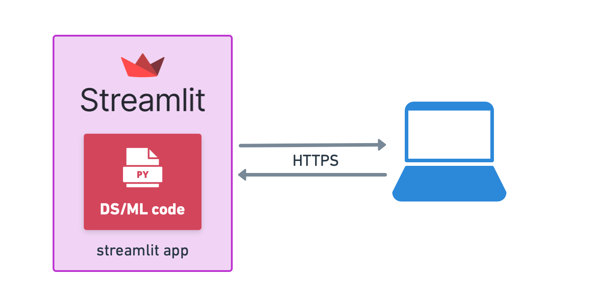

# Prototyping a Data Science Application with Streamlit

[Streamlit](https://streamlit.io) is a free, open-source, all-python framework
that enables data scientists to quickly build interactive dashboards and machine
learning web apps with no front-end web development experience required.

## Why use Streamlit

I think it could be a good option when you want to get a
[prototype](https://www.datarevenue.com/en-blog/data-dashboarding-streamlit-vs-dash-vs-shiny-vs-voila)
of your dashboard/web app up and running as quickly as possible.

## Project Setup

Installing Streamlit is as simple as installing any other Python package.

### Clone this repository

```shell
(base)$: git clone git@github.com:mafda/data_science_with_fastapi_and_streamlit.git
(base)$: cd data_science_with_fastapi_and_streamlit
```

### Configure environment

- Create the conda environment

```shell
(base)$: conda env create -f environment.yml
```

- and update with **development dependencies** (Read more about [Python Best
  Practices](https://github.com/mafda/python_best_practices))

```shell
(base)$: conda env update -n ds-app -f environment-dev.yml
```

- Activate the environment

```shell
(base)$: conda activate ds-app
```

- Run

```shell
(ds-app)$: streamlit run src/app.py
```

- And go to [http://localhost:8501](http://localhost:8501)

## Architecture



## Tools

- [Streamlit](https://streamlit.io)


---

made with 💙 by [mafda](https://mafda.github.io/)
