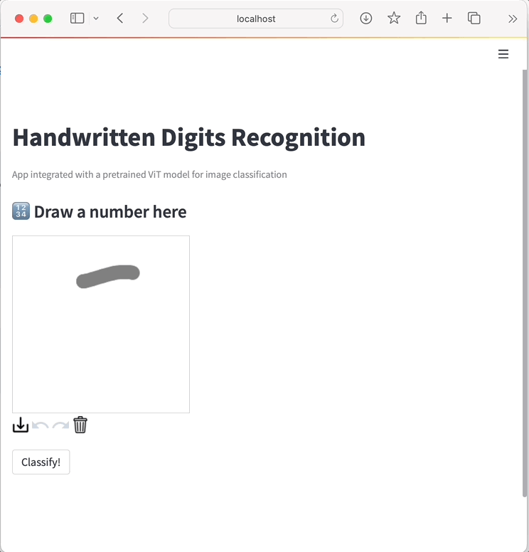

# Prototyping a ML Application with Streamlit, FastAPI and Hugging Face

- [Prototyping a ML Application with Streamlit, FastAPI and Hugging Face](#prototyping-a-ml-application-with-streamlit-fastapi-and-hugging-face)
  - [What is Prototyping?](#what-is-prototyping)
    - [Prototyping Tools](#prototyping-tools)
  - [What is Streamlit?](#what-is-streamlit)
    - [Why use Streamlit?](#why-use-streamlit)
    - [How does it Work?](#how-does-it-work)
  - [What is FastAPI?](#what-is-fastapi)
  - [What is Hugging Face?](#what-is-hugging-face)
  - [Example ML-App](#example-ml-app)
    - [Architecture](#architecture)
    - [Project Setup](#project-setup)
  - [Results](#results)
  - [Basic version (Only Streamlit)](#basic-version-only-streamlit)
  - [Tools](#tools)


During the development process of data science projects, we always need to
present the results of our findings at certain times. And we sometimes may have
doubts about what would be the best way to show these results. 

Then, this is where tools like Streamlit, FastAPI and Hugging Face emerge as a quick way to expose
functional results and don't need complex implementations. 

## What is Prototyping?

[Prototyping](https://www.interaction-design.org/literature/topics/prototyping)
is a process for developing an idea, and it is used in different areas to test
or simulate it before launching.

* A [prototype](https://en.wikipedia.org/wiki/Prototype) is a version of what
  the product will be.
* Prototyping is the iterative process of idea development.

> "So, we will have some **prototypes** of an idea in the **prototyping**
> process."

Prototyping is a fundamental step for any product, idea, or service type because
it allows:

* development of an initial version,
* discovery of flaws, 
* reduction in costs,
* knowledge of the users' experience,
* testing of features, and
* also, generation of [POCs](https://en.wikipedia.org/wiki/Proof-of-concept) or
  [MVPs](https://en.wikipedia.org/wiki/Minimum_viable_product) of the idea.

### Prototyping Tools

There are different tools according to the level of fidelity or similarity
between the idea and the final product. These levels can vary according to their
concept, aesthetic, and function.

* **Low-fidelity** prototyping is a paper draft of the idea.
* **Mid-fidelity** prototyping can be produced in software as a mockup,
  replicating some fundamental functionalities of the idea. Some tools for
  prototyping are [Figma](https://www.figma.com),
  [Sketch](https://www.sketch.com), [Miro](https://miro.com), and 
  [InVision](https://www.invisionapp.com).
* **High-fidelity** prototype may include some level of programming to replicate
  the final solution behavior fluidly.
  [Flask](https://flask.palletsprojects.com/en/2.1.x/) and
  [Streamlit](https://streamlit.io) are a couple of tools.

## What is Streamlit?

[Streamlit](https://streamlit.io) is a free, open-source, all-Python framework.
It enables data scientists to quickly build interactive dashboards and machine
learning web apps, without requiring front-end web development experience.

This framework has gained [attention and
popularity](https://www.datarevenue.com/en-blog/data-dashboarding-streamlit-vs-dash-vs-shiny-vs-voila)
among data scientists and machine learning programmers in recent years. Its
growth is due to the fact that it:

* is an easy-to-use tool,
* needs basic knowledge of Python, and
* is **compatible with frameworks** such as:
  * Machine Learning: TensorFlow, PyTorch, Scikit-learn,
  * Visualization libraries: Seaborn, Altair, Plotly, and
  * Others.

### How does it Work?

1. [Install
   Streamlit](https://docs.streamlit.io/library/get-started/installation). I
   recommend you use **Conda and set up your environment**, but you can use:

    ```shell
    pip install streamlit
    ```

2. [Create](https://docs.streamlit.io/library/get-started/create-an-app) a new
   Python script and import Streamlit with a few Streamlit commands:

    ```shell
    import streamlit as st
    ```

3. [Run](https://docs.streamlit.io/library/get-started/main-concepts) it:

    ```shell
    streamlit run your_script.py
    ```

    As soon as you run the script, a local Streamlit server will spin up, and
    your app will open in a new tab in your default web browser.

    Or you can navigate to `http://localhost:8501`.

## What is FastAPI? 

[FastAPI](https://fastapi.tiangolo.com) is a modern, fast (high-performance) web framework for building APIs with Python. It is based on standard Python type hints, which allows for automatic data validation, serialization, and documentation generation. 

FastAPI is designed to be easy to use and highly efficient, providing features such as asynchronous support, dependency injection, and automatic generation of OpenAPI and JSON Schema documentation.

 It has gained popularity in the Python community due to its ease of use, performance, and developer-friendly features.

## What is Hugging Face? 

[Hugging Face](https://huggingface.co) is a company and an open-source community that focuses on natural language processing (NLP) and machine learning. 

Hugging Face provides a wide range of tools, libraries, and resources that are widely used by researchers, developers, and data scientists for building, training, and deploying NLP models.

## Example ML-App

I used a pretrained [ViT](https://huggingface.co/farleyknight-org-username/vit-base-mnist) model for image classification. This model is a fine-tuned version of [google/vit-base-patch16-224-in21k](https://huggingface.co/google/vit-base-patch16-224-in21k) on the [mnist](http://yann.lecun.com/exdb/mnist/) dataset.

### Architecture


### Project Setup

- Clone this repository

```shell
(base)$: git clone git@github.com:mafda/ml_with_fastapi_and_streamlit.git
(base)$: cd ml_with_fastapi_and_streamlit
```

- Run the applications

```shell
$ docker-compose up
```

- And go to [http://localhost:8501](http://localhost:8501)

## Results




## Basic version (Only Streamlit)

- Change the branch

```shell
(base)$: git checkout streamlit-basic
```

- Create the conda environment

```shell
(base)$: conda env create -f environment.yml
```

- Activate the environment

```shell
(base)$: conda activate ml-app
```

- Run

```shell
(ml-app)$: streamlit run src/app.py
```

- And go to [http://localhost:8501](http://localhost:8501)

## Conclusions

Streamlit, FastAPI and Hugging Face could be seen as an opportunity in situations like:

* **prototyping** quickly,
* creating **MVP**,
* putting an application into production in a few weeks, and
* sharing a link with the client or user of the system that is being developed.

So, I think it could be a good option when you want to get a
[prototype](https://www.datarevenue.com/en-blog/data-dashboarding-streamlit-vs-dash-vs-shiny-vs-voila)
of your dashboard/web app up and **run it as quickly as possible**.

## Tools

- [FastAPI](https://fastapi.tiangolo.com)
- [Hugging Face](https://huggingface.co)
- [Streamlit](https://streamlit.io)
- [streamlit-drawable-canvas](https://pypi.org/project/streamlit-drawable-canvas/)

---

made with 💙 by [mafda](https://mafda.github.io/)
